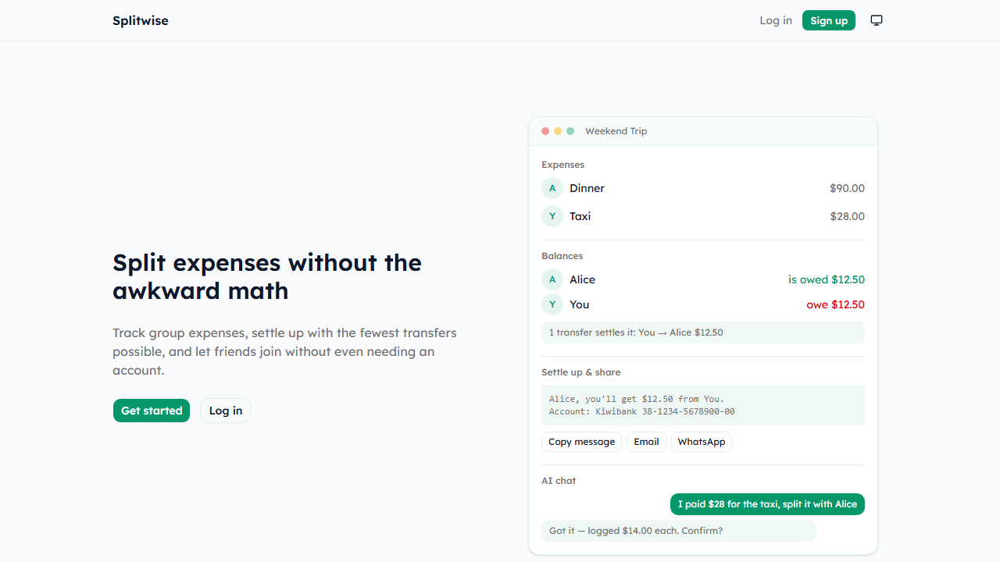
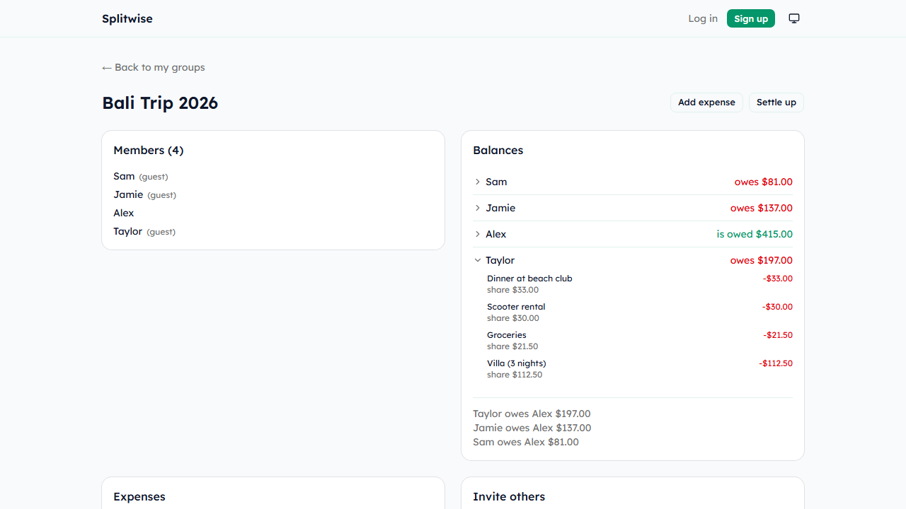
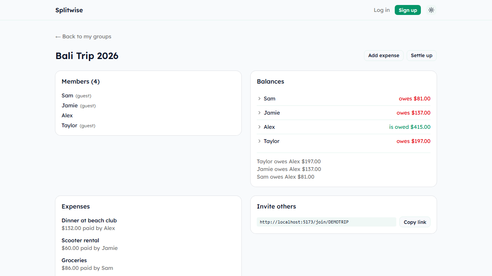
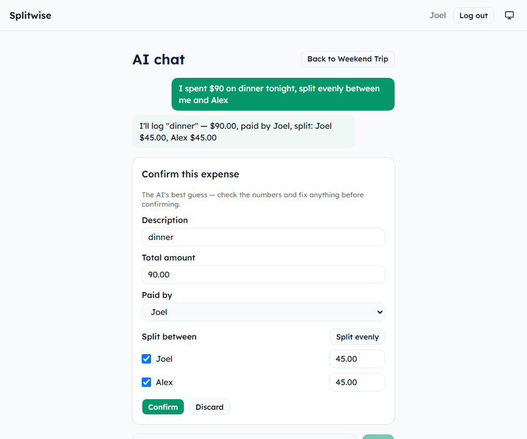

# Splitwise Clone

A group expense-splitting app that tracks shared costs, settles up with the fewest possible transfers, and logs expenses conversationally through an AI chat assistant. Built as a portfolio project to explore a layered ASP.NET Core backend, real security fundamentals (hashing vs. encryption, permission-by-construction), and a responsible pattern for integrating an LLM into a product that touches real money.

**Live demo.** Coming soon (see [Deployment](#deployment)). Until then, run it locally (below) and open `/join/DEMOTRIP` to browse a seeded demo group with no sign-up required.



## Features

- **Group expenses & settlements.** Log shared costs, see running balances, and settle up with a greedy minimum-cash-flow algorithm that guarantees the fewest possible transfers between people
- **Guest participation.** Anyone can join a group and log their own expenses from just an invite link, no account required. Only the group's sign-in creator(s) can edit or delete an expense
- **AI chat.** Describe an expense in plain English ("I spent $90 on dinner, split evenly") and review a structured, editable suggestion before anything is saved. Can also re-split an expense already logged, or add a member by name, in the same message
- **Balance breakdown.** Click any member's balance to see exactly which expenses it's made of, not just the final number
- **Settlement messages.** Generates a ready-to-send message (with the recipient's bank details, decrypted on demand) for email, WhatsApp, or copy-paste
- **Dark mode**, a responsive layout, and a seeded demo group for browsing without registering

<p float="left">
  
  
</p>

## AI chat design

The chat doesn't write to the database directly. It calls an OpenAI function-calling tool that returns *structure* (who paid, who's splitting it, who has an extra personal item), and the backend (`AiChatService`) does every division and rounding calculation itself. This split matters because an LLM is reliable at pulling intent out of natural language but not at exact multi-step arithmetic, so the parts that have to be exactly right never go through the model at all. The result is shown as an editable confirm card (the same permission model as everywhere else in the app), and nothing is persisted until the user confirms it.



## Security

- **Passwords** are hashed with bcrypt. One-way, only ever verified, never decrypted
- **Bank account numbers** are AES-256 encrypted. Two-way, because the whole point is to decrypt and show them again when someone settles up. Using the same approach for both would either make login impossible to verify or make account numbers unrecoverable, so the two mechanisms are deliberately different
- **Guest permissions are enforced by the data model, not a role flag.** A guest's `Member.UserId` is always `null`, and the check for "can this person edit this expense" is `expense.CreatedByMember.UserId == requestingUserId`. A guest's `null` can structurally never equal a real user id, so there's no code path that can accidentally let a guest edit or delete anything
- **Invite codes** are 8-character cryptographically random strings, generated with `RandomNumberGenerator`, from an alphabet that excludes visually ambiguous characters (`0/O`, `1/I/L`)

## Settlement algorithm

Given each member's net balance (what they paid minus what they owe), the greedy algorithm repeatedly matches the largest creditor with the largest debtor and settles the smaller of the two amounts, until every balance is zero. It's O(n log n) and gets very close to the theoretical minimum number of transfers in practice, though it isn't guaranteed to be *exactly* optimal. Finding the true minimum is closer to a bin-packing problem (NP-hard) than something a greedy pass can solve outright. The tradeoff is deliberate. A fast, simple, well-tested approximation beats an exact solver nobody needs for group sizes this small.

## Tech stack

| | |
|---|---|
| Backend | ASP.NET Core (.NET 10), Entity Framework Core, SQLite (dev) / Postgres (planned prod) |
| Frontend | React 19 + TypeScript, Vite, Tailwind CSS v4, shadcn/ui, Zustand |
| Auth | JWT (HS256) |
| AI | OpenAI Chat Completions (gpt-4o-mini), function calling |
| Testing | xUnit, 76 tests covering settlement math, permission rules, and AI-chat resolution logic |
| CI | GitHub Actions, backend test/build and frontend lint/build on every push |

## Getting started

### Backend

```bash
cd backend/Splitwise.Api
dotnet user-secrets set "Jwt:Key" "<a long random string>"
dotnet user-secrets set "Encryption:AesKeyBase64" "<base64-encoded 32-byte key>"
dotnet user-secrets set "OpenAi:ApiKey" "<your OpenAI API key>"
dotnet run
```

Runs on `http://localhost:5143`. Migrations apply automatically on startup, and a demo group (`/join/DEMOTRIP`) seeds automatically in the Development environment.

### Frontend

```bash
cd frontend
npm install
npm run dev
```

Runs on `http://localhost:5173`.

### Tests

```bash
cd backend
dotnet test
```

## Project structure

```
backend/
  Splitwise.Api/          ASP.NET Core Web API
    Controllers/          Thin HTTP layer, delegates to services, maps Result → status code
    Services/              Business logic (auth, groups, expenses, balances, AI chat)
    Models/                EF Core entities
    Dtos/                  Request/response shapes per feature
  Splitwise.Api.Tests/     xUnit tests, one file per service
frontend/
  src/pages/               One component per route
  src/components/ui/       shadcn/ui primitives
  src/stores/               Zustand stores (auth, guest session, theme)
specs/
  splitwise-clone-spec.md  The original design spec this was built from
```

## Deployment

The plan is Vercel (frontend), Render or Railway (API), and Neon (Postgres). Not yet live. This section will be updated with a real link once it is.
